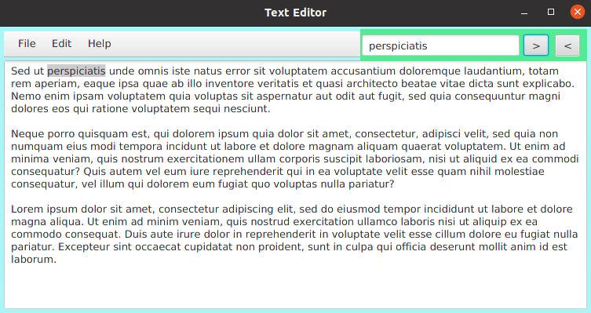

# TEXT EDITOR

A simple **Java FX Application** to edit find and replace the contents of a document.

## Built With

- JavaSE

## Getting Started

1. Clone the repository first 

``https://github.com/Direct-Entry-Programe-7/Text-Editor.git``

2. Once cloned, open the repository from the IntelliJ IDEA

3. Run the application!

## Contact

Nethmina Senarathne- [LinkedIn](https://www.linkedin.com/in/nethmina-senarathne-7527a6148/)

## License

Copyright &copy; Nethmina Senarathne. All rights reserved.

Licensed under the [MIT](LICENSE) license
